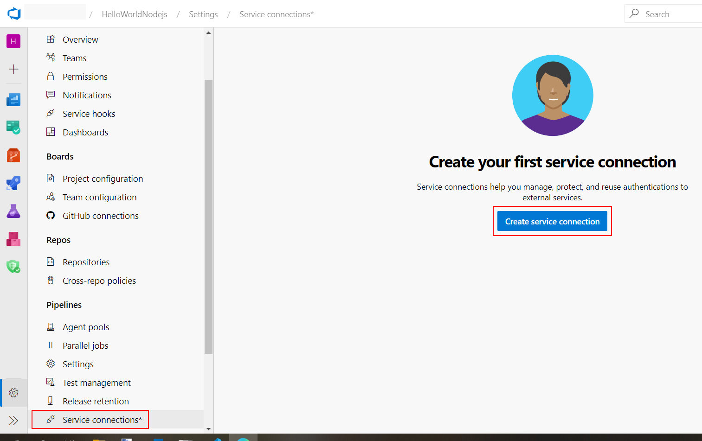
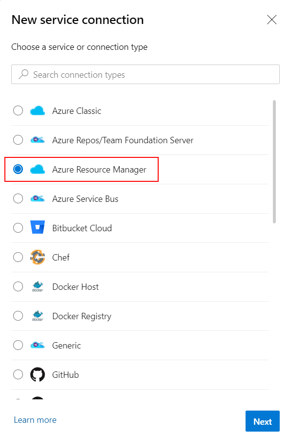
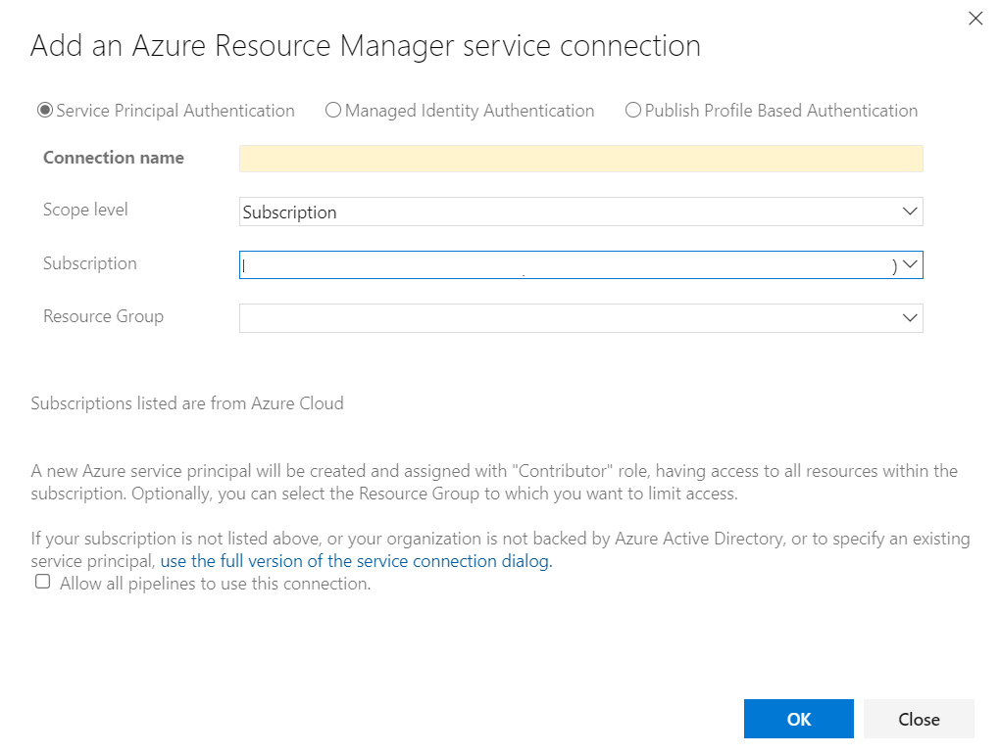

# Azure DevOps 持續整合/持續交付 (CI/CD,Continuous Integration Continuous Delivery) 功能實機操作

## Lab 5 在 Azure DevOps 內建立服務連線 (Service connections) 

1.在使用 Azure DevOps Pipelines 功能建立自動化持續整合/持續交付之前，我們必須為 Azure DevOps Pipelines 先建立妥服務連線 ( Service connections )，Azure DevOps Pipelines 其實就是自動化從 Agents Pool 內建立一台乾淨的 Azure Virtual Machines，在此虛擬機器內將程式碼自版本管控系統中取出，依據所使用的程式語言所需的建構與部署方式，依照用戶的配置逐步執行。既然是一台獨立的虛擬機器，此虛擬機器必須設定妥存取 Azure 其他資源所需的必要權限，而配置服務連線 ( Service connections ) 的目的就在賦予 Azure DevOps Pipelines 執行過程中所需的權限。

請以瀏覽器登入 https://dev.azure.com/ 進入 Azure DevOps 入口管理網站，並如圖點選左下方的專案設定 (**Project settings**)

2.進入專案設定畫面後，請點選左下方 **Service connections***，並按下 **Create service connection** 按鈕準備建立服務連線。

3.Azure DevOps Pipelines 支援多種服務連線模式，由於在 Lab3 與 Lab 4 中我們所建立的 Azure Container Registry 與 Azure Web App for Containers Linux 都位於同一個資源群組 myDevOpsResourceGroup 之內，我們可以選擇建立 **Azure Resource Manager** 的服務連線。選擇完畢後按下 **Next** 按鈕。

4. **Azure Resource Manager** 的服務連線擁有三種身分驗證的方式，以確認 Azure DevOps Pipelines 具備權限存取相關資源，在此我們選擇左方以服務主體作為身分驗證方式 **Service Principal Authentication**，以 MyAzureConnection 此服務連線名稱，您必須在此畫面選妥訂閱帳號與服務主體的存取範圍，也就是之前 Lab 3 所建立的資源群組 myDevOpsResourceGroup。當按下 **OK** 按鈕後，Azure DevOps 就會對 Azure AD 註冊並建立一個服務主體，完成服務連線的設定。

* [前往練習 Lab 6](Labs-06.md)
* [返回 README](README.md)